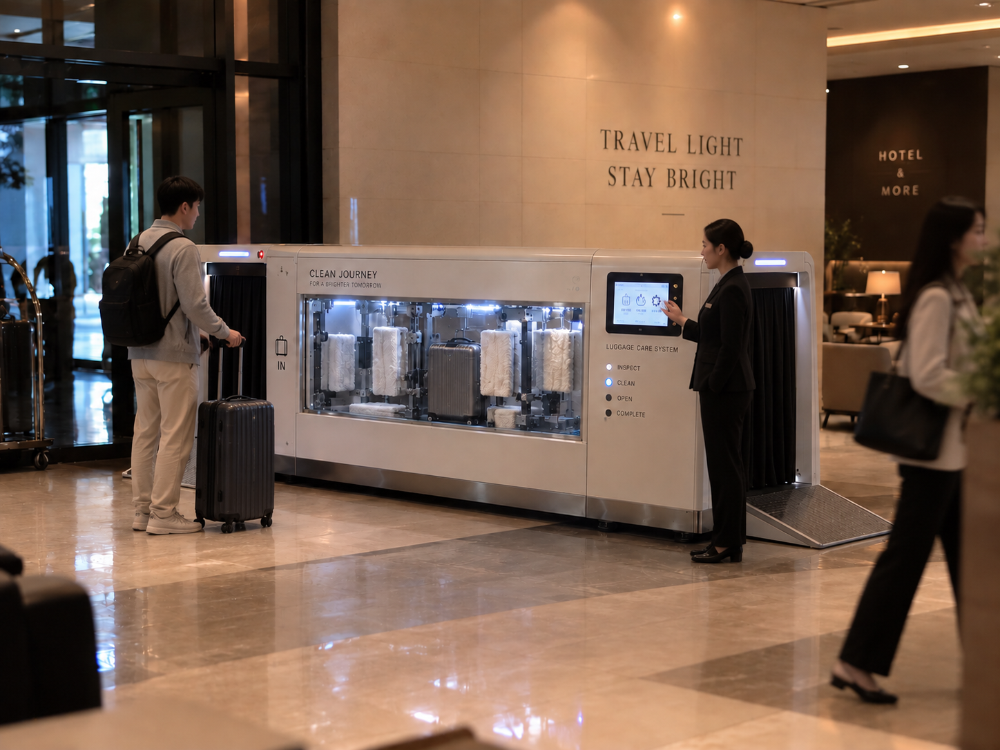
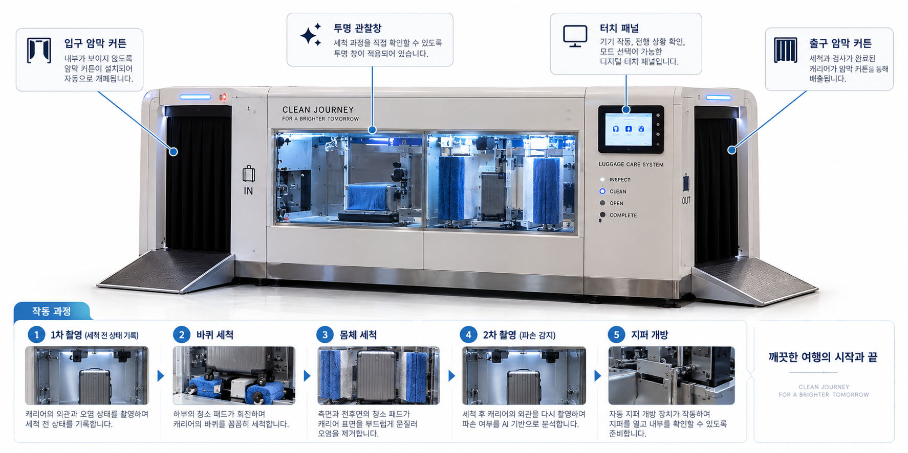
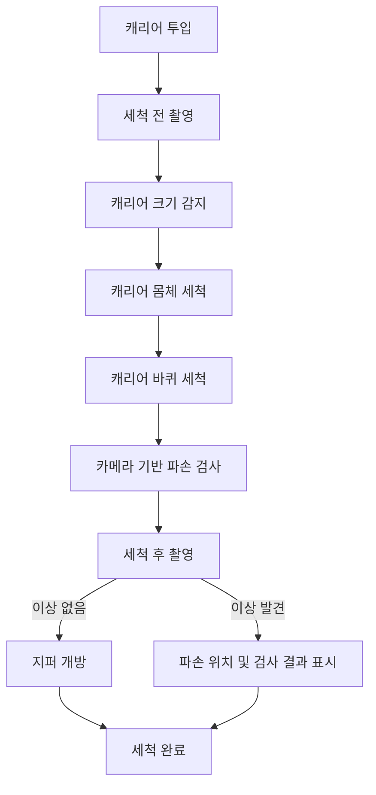

  

<h1 align="center">캐리어 자동 청소 및 관리 장치</h1>

  캐리어의 <strong>몸체와 바퀴를 자동으로 세척</strong>하고, 
  카메라를 이용해 <strong>외관 파손 여부를 검사</strong>하는 자동 관리 시스템

  <a href="#프로젝트-소개">프로젝트 소개</a> ·
  <a href="#주요-기능">주요 기능</a> ·
  <a href="#동작-흐름">동작 흐름</a> ·
  <a href="#기능-상세">기능 상세</a> ·
  <a href="#팀원">팀원</a> ·
  <a href="#문서">문서</a>

---

## 프로젝트 소개

> 인천대학교 임베디드시스템공학과 캡스톤디자인 프로젝트

캐리어의 **몸체와 바퀴를 자동으로 세척**하고, 카메라를 이용해 **외관 파손 여부를 검사**하는 자동 관리 시스템입니다.

단순 세척뿐만 아니라 캐리어의 상태를 확인하고 관리할 수 있는 통합 장치를 목표로 하며, 현재 **몸체 세척, 바퀴 세척, 파손 검사, 지퍼 개방** 기능을 중심으로 설계하고 있습니다.

### 프로젝트 배경

여행 후 캐리어의 몸체와 바퀴에는 먼지와 오염물이 많이 묻지만, 크기와 구조 때문에 사용자가 직접 세척하기 어렵습니다.

캐리어를 장치에 투입하면 몸체와 바퀴를 자동으로 세척하고, 세척 전후 상태를 확인할 수 있는 장치를 제작하고자 합니다.

## 주요 기능

| 우선 구현 | 검토 중 |
| --- | --- |
| 캐리어 몸체 자동 세척 | 캐리어 지퍼 자동 개방 |
| 캐리어 바퀴 자동 세척 |  |
| 다양한 캐리어 크기에 대응하는 고정 구조 |  |
| 카메라를 이용한 세척 전후 상태 비교 |  |
| 외관 파손 위치 확인 |  |

## 동작 흐름

  

## 기능 상세

<strong>캐리어 몸체 자동 세척</strong>

 

캐리어의 전면, 후면 및 측면을 자동으로 세척하는 기능입니다.

- 캐리어 크기 및 위치 감지
- 브러시를 이용한 표면 세척
- 다양한 크기의 캐리어 대응 구조 검토

<strong>캐리어 바퀴 자동 세척</strong>

 

외부 오염이 집중되는 캐리어 바퀴를 별도로 세척합니다.

- 회전 브러시를 이용한 집중 세척
- 바퀴 회전을 이용한 전체 면 세척

<strong>캐리어 파손 검사</strong>

 

세척 과정에서 카메라를 이용해 캐리어의 외관 상태를 확인합니다.

- 카메라 기반 캐리어 외관 촬영
- 흠집, 균열 등 외관 이상 탐지
- 바퀴 및 손잡이 상태 확인
- 파손 위치 및 검사 결과 표시

<strong>캐리어 지퍼 개방</strong>

 

캐리어의 지퍼를 기계적으로 개방하는 기능을 구현합니다.

- 지퍼 손잡이 고정 방식 설계
- 모터를 이용한 지퍼 이동
- 다양한 캐리어 지퍼 구조 대응 방법 검토

## 팀원

| 역할 | 이름 | 소속 |
| --- | --- | --- |
| 팀장 | 배정훈 | 임베디드시스템공학과 22학번 학부 3학년 |
| 팀원 | 김도엽 | 임베디드시스템공학과 22학번 학부 3학년 |
| 팀원 | 김성민 | 임베디드시스템공학과 22학번 학부 3학년 |
| 팀원 | 김해수 | 임베디드시스템공학과 24학번 학부 3학년 |
| 팀원 | 손은성 | 임베디드시스템공학과 24학번 학부 3학년 |

## 문서

| 문서 | 내용 |
| --- | --- |
| [1주차 회의록](<Meeting notes/[2026.09.13] meeting.md>) | 캡스톤 아이디어 브레인스토밍 |
| [2주차 회의록](<Meeting notes/[2026.09.21] meeting.md>) | 자동 캐리어 세척 구조 구체화 |
| [회의록 템플릿](<Meeting notes/_template.md>) | 공통 회의록 작성 형식 |
| [커밋 메시지 규칙](commit-convention.md) | Conventional Commits 기반 커밋 규칙 |
